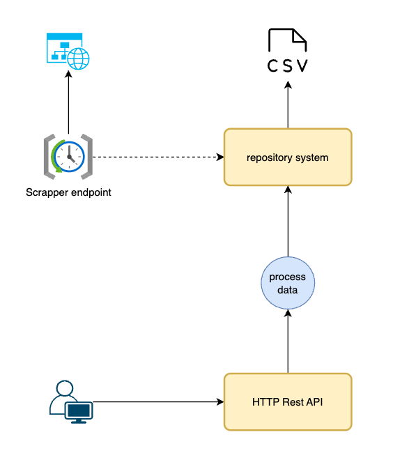
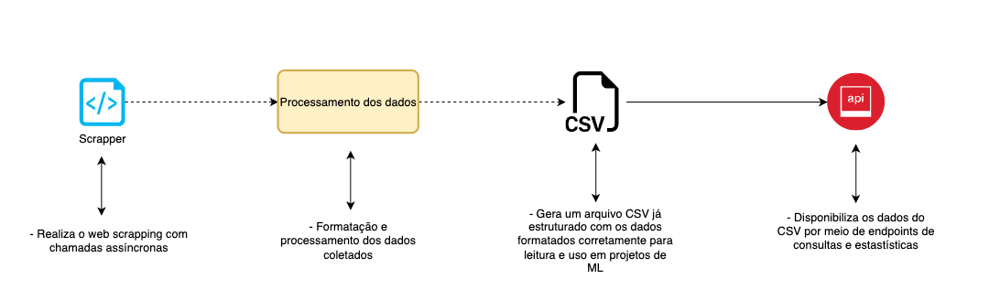

# Arquitetura - Books API

Este documento detalha o pipeline completo de dados da Books API, desde a ingestão dos dados do website até o consumo final pelos usuários.

## Arquitetura utilizada no projeto

Atualmente o sistema conta com o seguinte design de infraestrutura, contato com o csv local para armazenamento de dados e endpoints REST para atualização dos dados e informações armazenadas.



O design e arquitetura dos arquivos foram pensadas em possíveis evoluções de nosso sistemas, buscando trazer uma simplicidade em mudanças de infraestrutura ou serviços externos

## Visão Geral do Pipeline de processamento

O pipeline de dados da Books API é composto por 4 etapas principais:

1. **Ingestão e Processamento**: Extração de dados do website books.toscrape.com já realizando a transformação necessária dos dados
2. **API**: Disponibilização dos dados via endpoints REST



## Etapas Detalhadas do Pipeline

### 1. Ingestão de Dados 🔍

Disponibilizamos um endpoint que aciona o script de raspagem de dados do site configurado, este script retorna todos os dados encontrados nas páginas e realizando a formatação e processamento de dados.

**Preço do livro:** Realizamos a conversão do preço de string separando em dois campos

- price: Irá conter o valor do livro
- currency: Irá armazenar a moeda do valor do Livro.

**Nota do livro:** A nota no site é retornada como um texto nominal do número, realizamos a conversão para um inteiro.

com os dados já formatados salvamos os resultados em um arquivo CSV local.


#### Exemplo de dado salvo

```json
{
  "title": "A Light in the Attic",
  "price": 51.77,
  "currency": "£",
  "rating": 3,
  "category": "Poetry",
  "image_url": "media/cache/2c/da/2cdad67c44b002e7ead0cc35693c0e8b.jpg"
}
```

### 2. API REST

Para a consulta dos dados resgatados, disponibilizamos uma série de endpoints REST para consumo.

```python
# 1. Listar todos os livros
GET /api/v1/books
# Response: List[Book]

# 2. Buscar livros com filtros
GET /api/v1/books/search?category=Fiction&min_price=10&max_price=50
# Response: BookSearchResponse

# 3. Obter livros mais bem avaliados
GET /api/v1/books/top-rated?limit=10
# Response: ResultsResponse[Book]

# 4. Obter livros por faixa de preço
GET /api/v1/books/price-range?min=20&max=40
# Response: ResultsResponse[Book]

# 5. Obter estatísticas
GET /api/v1/stats/overview
# Response: ResultsResponse[Dict]

# 6. Obter categorias disponíveis
GET /api/v1/categories
# Response: ResultsResponse[str]

# 7. Executar scraping
POST /api/v1/jobs/scrape
# Response: {"status": "ok"}
```

Todos os endpoints também estão disponíveis na documentação do swagger que podem ser encontradas no endpoint /docs


## Evolução 

- **[Plano de Arquitetura](architecture_plan.md)** - Arquitetura detalhada e roadmap de evolução
